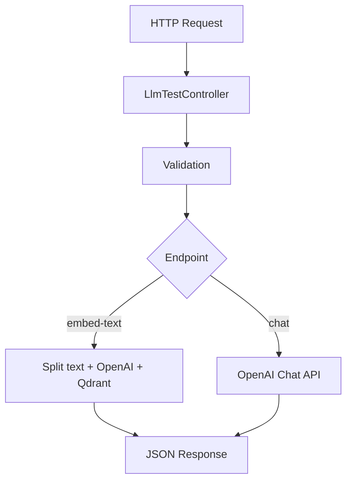

# Design Document

## Overview

This feature implements simple test LLM endpoints for text embedding and chat functionality. The implementation is intentionally minimal and straightforward - just basic API endpoints to test OpenAI integration and Qdrant vector storage. No complex architecture or over-engineering, just essential functionality to validate the AI integration works.

## Steering Document Alignment

### Technical Standards (tech.md)

**Simple Structure**: Create minimal files under `app/features/ai/` - just one controller and basic validation.

**Basic TypeScript**: Use existing patterns but keep interfaces simple.

**Simple Error Handling**: Basic try/catch with JSON error responses.

### Project Structure (structure.md)

**File Organization**:
- Controller: `app/features/ai/controllers/llm_test_controller.ts` (contains all logic)
- Validator: `app/features/ai/validators/llm_test_validator.ts` (basic validation)

**Environment Configuration**: Use existing `.env` variables (`OPENAI_API_KEY`, `QDRANT_HOST`, `QDRANT_PORT`).

## Code Reuse Analysis

### Existing Components to Leverage

- **VineJS Validation**: Use existing validation patterns for request validation
- **Controller Pattern**: Follow existing controller structure from `AuthController`
- **Environment Variables**: Use existing `.env` setup

### Integration Points

- **Route Registration**: Add routes to existing routing structure
- **External APIs**: Direct HTTP calls to OpenAI and Qdrant APIs

## Architecture

Simple and direct approach:

1. **Controller**: Handle requests, validate input, call external APIs, return responses
2. **Validation**: Basic VineJS validation for required fields



## Components and Interfaces

### LlmTestController
- **Purpose:** Handle both endpoints with all logic in one place
- **Methods:**
  - `embedText()` - Split text, call OpenAI, store in Qdrant
  - `chat()` - Call OpenAI chat API
- **Dependencies:** OpenAI API, Qdrant HTTP API, LangChain text splitter

## Data Models

Simple request/response interfaces:

```typescript
// Requests
interface EmbedTextRequest {
  content: string;
  user: string;
}

interface ChatRequest {
  prompt: string;
  user: string;
}

// Responses
interface EmbedResult {
  success: boolean;
  chunksProcessed: number;
}

interface ChatResult {
  success: boolean;
  response: string;
}
```

## Error Handling

Basic error handling:

1. **API Failures** - Return 500 with simple error message
2. **Validation Errors** - Return 400 with validation details
3. **Missing Environment Variables** - Return 500 with configuration error

## Testing Strategy

Basic testing approach:

- **Unit Tests**: Test controller methods with mocked external APIs
- **Integration Tests**: Test with real APIs in development
- **Manual Testing**: Verify endpoints work with sample data