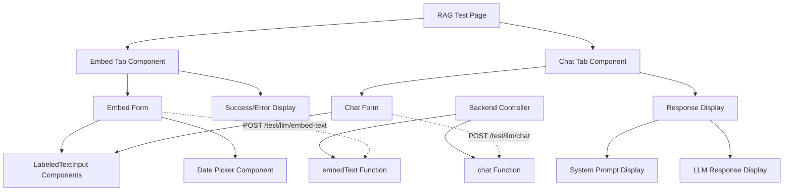

# Design Document

## Overview

The RAG Test Interface is a developer testing tool that provides a tabbed interface for testing LLM embedding and chat functionality. The feature will be implemented as a new Inertia page with two tabs: one for embedding text content and another for chatting with the LLM using embedded context. The design follows the established AdonisJS + Inertia + React patterns used throughout the application, particularly mirroring the Registration page's form handling approach.

## Steering Document Alignment

### Technical Standards (tech.md)

**Framework Integration:**
- Uses AdonisJS v6 routing and Inertia.js for server-driven navigation
- Follows React 18+ patterns with TypeScript strict mode
- Leverages existing daisyUI v5 + Tailwind CSS v4 styling system
- Implements Inertia's `useForm` hook for consistent form handling

**Code Organization:**
- Follows domain-driven structure under `inertia/pages/`
- Uses existing component patterns from `inertia/components/form/`
- Maintains TypeScript interfaces for type safety
- Follows established error handling patterns

**Security & Performance:**
- No CSRF protection required (test APIs excluded)
- Client-side validation with server-side integration
- Responsive design following existing patterns

### Project Structure (structure.md)

**File Organization:**
- New page: `inertia/pages/rag-test/Index.tsx`
- New route: `GET /rag-test` in `start/routes.ts`
- Reuses existing form components from `inertia/components/form/`
- Follows PascalCase naming for React components
- Uses kebab-case for routes and file paths

**Integration Points:**
- Connects to existing LLM test controller at `app/features/ai/llm_test_controller.ts`
- Uses existing date formatting from `shared/utils.ts`
- Follows Inertia page patterns established in `inertia/pages/auth/Register.tsx`

## Code Reuse Analysis

### Existing Components to Leverage

- **LabeledTextInput**: Reuse for "User" input fields with consistent styling and error handling
- **TextInput**: Base input component for form fields
- **formatDate**: Utility function from `shared/utils.ts` for consistent date formatting
- **useForm**: Inertia's form handling hook following Registration page pattern
- **Head**: Inertia component for page title and meta tags

### Integration Points

- **LLM Test Controller**: Existing `/test/llm/embed-text` and `/test/llm/chat` endpoints
- **daisyUI Components**: Tab system, date picker, buttons, cards, and alerts
- **Inertia Navigation**: Server-driven routing and form submission
- **Existing Styling**: Tailwind CSS v4 with daisyUI v5 theme variables

## Architecture

The RAG Test Interface follows a component-based architecture with clear separation of concerns:

### Modular Design Principles

- **Single File Responsibility**: Main page component handles tab state, separate form components for embed/chat
- **Component Isolation**: Embed form, chat form, and response display as separate focused components
- **Service Layer Separation**: Frontend components connect to existing backend services via Inertia
- **Utility Modularity**: Reuse existing date formatting and form handling utilities



## Components and Interfaces

### RAG Test Page Component (`inertia/pages/rag-test/Index.tsx`)
- **Purpose:** Main page container with tab navigation and state management
- **Interfaces:** Inertia page props, tab state management
- **Dependencies:** React, Inertia Head, tab components
- **Reuses:** Existing page layout patterns, daisyUI tab components

### Embed Tab Component
- **Purpose:** Handles text embedding form and submission
- **Interfaces:** Form data (content, user, date), submission callbacks
- **Dependencies:** useForm hook, LabeledTextInput, date picker
- **Reuses:** Registration page form patterns, existing input components

### Chat Tab Component
- **Purpose:** Handles chat form submission and response display
- **Interfaces:** Chat data (prompt, user), response display
- **Dependencies:** useForm hook, LabeledTextInput, response components
- **Reuses:** Form handling patterns, existing styling components

### Date Picker Component
- **Purpose:** daisyUI v5 date and time selection
- **Interfaces:** Date/time value, onChange callback
- **Dependencies:** daisyUI v5 date picker
- **Reuses:** Existing daisyUI theme and styling

## Data Models

### Embed Form Data
```typescript
interface EmbedFormData {
  content: string;      // Text content to embed
  user: string;         // User context for filtering
  date: string;         // Formatted date string using formatDate()
}
```

### Chat Form Data
```typescript
interface ChatFormData {
  prompt: string;       // User's chat prompt
  user: string;         // User context for filtering
}
```

### API Response Types
```typescript
interface EmbedResponse {
  success: boolean;
  chunksProcessed?: number;
  collection?: string;
  error?: string;
}

interface ChatResponse {
  success: boolean;
  response?: string;
  systemPrompt?: string;
  error?: string;
}
```

### Tab State
```typescript
type TabType = 'embed' | 'chat';

interface TabState {
  activeTab: TabType;
  setActiveTab: (tab: TabType) => void;
}
```

## Error Handling

### Error Scenarios

1. **Network/API Failures:**
   - **Handling:** Catch errors in useForm onError callback
   - **User Impact:** Display error message using daisyUI alert components

2. **Validation Errors:**
   - **Handling:** Client-side validation before submission
   - **User Impact:** Show field-specific error messages below inputs

3. **Backend Service Unavailable:**
   - **Handling:** Handle 500/503 responses gracefully
   - **User Impact:** Display user-friendly "Service temporarily unavailable" message

4. **Invalid Date Selection:**
   - **Handling:** Validate date picker input before formatting
   - **User Impact:** Show validation message for invalid dates

## Testing Strategy

### Browser MCP Testing Approach

**Primary Testing Method:** Use Browser MCP for all testing activities instead of creating test scripts. This approach provides comprehensive testing capabilities for test pages and APIs.

### Browser MCP Testing Activities

**Navigation and UI Testing:**
- Use Browser MCP to navigate to `/rag-test` page
- Take screenshots of the interface for visual verification
- Test tab switching functionality by clicking between "Embed Text" and "Chat" tabs
- Verify responsive design on different viewport sizes

**Form Interaction Testing:**
- Use Browser MCP to input text into form fields (content textarea, user fields)
- Test date picker interaction and selection
- Verify form validation by submitting with empty/invalid data
- Take screenshots of error states and success messages

**API Integration Testing:**
- Use Browser MCP to submit forms and capture network logs
- Monitor network requests to `/test/llm/embed-text` and `/test/llm/chat` endpoints
- Verify request payloads and response handling
- Capture console logs for debugging any JavaScript errors

**End-to-End Flow Testing:**
- **Embed Flow:** Navigate → fill embed form → submit → capture response → screenshot results
- **Chat Flow:** Navigate → switch to chat tab → submit prompt → capture response → screenshot results
- **Error Handling:** Submit invalid data → capture error messages → screenshot error states

### Quick API Testing

**curl Commands for Direct API Testing:**
```bash
# Test embed endpoint
curl -X POST http://localhost:3333/test/llm/embed-text \
  -H "Content-Type: application/json" \
  -d '{"content":"Test content","user":"testuser","date":"Wednesday, January 15, 2025 - 2:30 PM"}'

# Test chat endpoint
curl -X POST http://localhost:3333/test/llm/chat \
  -H "Content-Type: application/json" \
  -d '{"prompt":"What is the test content about?","user":"testuser"}'
```

### Testing Documentation

**Browser MCP Capabilities to Utilize:**
- **Screenshots:** Capture visual state at each testing step
- **Network Logs:** Monitor API requests and responses
- **Console Logs:** Capture JavaScript errors and debug information
- **Element Interaction:** Click, type, select for comprehensive UI testing
- **Navigation:** Test routing and page transitions

**No Test Scripts Required:**
- Do not create unit test files for this test page
- Do not create integration test scripts for the test APIs
- Rely entirely on Browser MCP for manual testing and verification
- Use curl for quick API endpoint validation

## Implementation Details

### Route Configuration
```typescript
// start/routes.ts
router.get("/rag-test", ({ inertia }) => {
  return inertia.render("rag-test/Index");
});
```

### Navigation Integration
Update the landing page navigation to include the RAG Test button:
```tsx
// inertia/pages/landing.tsx - Add to navigation section
<Link href="/rag-test" className="btn btn-ghost btn-sm">
  RAG Test
</Link>
```

### Form Handling Pattern
Following the Registration page pattern:
```tsx
const { data, setData, post, processing, errors } = useForm({
  content: "",
  user: "",
  date: "",
});

const submit = (e: React.FormEvent) => {
  e.preventDefault();
  post("/test/llm/embed-text", {
    onSuccess: () => {
      // Handle success
    },
    onError: () => {
      // Handle errors
    },
  });
};
```

### Date Integration
```tsx
// Format date using existing utility
import { formatDate } from "#shared/utils";

const handleDateChange = (selectedDate: Date) => {
  const formattedDate = formatDate(selectedDate);
  setData("date", formattedDate);
};
```

### Response Display
```tsx
// Display both LLM response and system prompt for debugging
<div className="space-y-4">
  <div className="card bg-base-200">
    <div className="card-body">
      <h3 className="card-title">LLM Response</h3>
      <p>{response}</p>
    </div>
  </div>
  <div className="card bg-base-300">
    <div className="card-body">
      <h3 className="card-title">System Prompt (Debug)</h3>
      <pre className="text-sm">{systemPrompt}</pre>
    </div>
  </div>
</div>
```

This design ensures consistency with existing patterns while providing a robust testing interface for the RAG functionality, with comprehensive Browser MCP testing approach and no traditional test scripts.