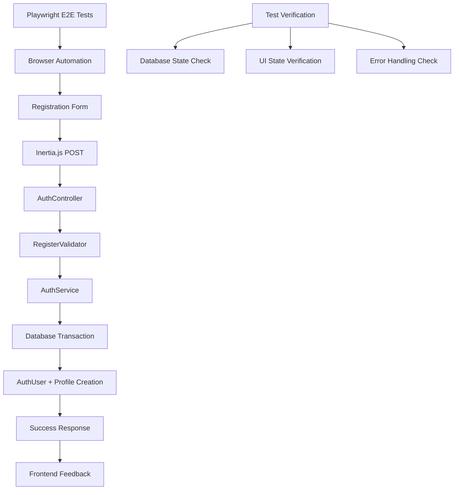

# Design Document

## Overview

This design enhances the existing registration system by adding comprehensive Playwright end-to-end testing, improving error handling, and ensuring robust verification of the complete registration flow from frontend interaction to database persistence.

The existing registration system already includes all core functionality:
- Backend: AuthUser and Profile models, AuthService, AuthController, validation
- Frontend: React registration form with Inertia.js integration
- Testing: Japa functional tests for API endpoints

This enhancement focuses on adding E2E testing with Playwright to verify the complete user journey and ensure cross-browser compatibility.

## Steering Document Alignment

### Technical Standards (tech.md)
- **Testing Strategy**: Follows established Playwright E2E testing patterns
- **Database Integration**: Leverages existing UUID-based models and soft-delete patterns
- **Error Handling**: Builds on existing VineJS validation and custom exception handling
- **Performance Standards**: Maintains p95 < 200ms response times during testing

### Project Structure (structure.md)
- **Test Organization**: Follows `tests/browser/` structure for E2E tests
- **Domain-Driven Design**: Enhances existing `app/features/auth/` structure
- **File Naming**: Follows established conventions for test files

## Code Reuse Analysis

### Existing Components to Leverage
- **AuthUser Model**: `app/features/auth/models/auth_user.ts` - Already implements UUID PKs and password hashing
- **Profile Model**: `app/features/user/models/profile.ts` - Already implements user profile data structure
- **AuthService**: `app/features/auth/services/auth_service.ts` - Already implements registration logic with transaction handling
- **AuthController**: `app/features/auth/controllers/auth_controller.ts` - Already implements Inertia registration endpoints
- **Register Validator**: `app/features/auth/validators/register_validator.ts` - Already implements VineJS validation
- **Register Component**: `inertia/pages/auth/Register.tsx` - Already implements React form with error handling

### Integration Points
- **Database**: Existing PostgreSQL with UUID primary keys and transaction support
- **Testing Infrastructure**: Existing Japa test setup with database cleanup utilities
- **Inertia Integration**: Existing shared props middleware for flash messages and errors

## Architecture

### Enhanced Testing Architecture



### Modular Design Principles
- **Test Isolation**: Each test scenario runs in isolated database state
- **Reusable Utilities**: Common test setup and teardown functions
- **Page Object Pattern**: Encapsulate registration form interactions
- **Assertion Helpers**: Specific database and UI verification utilities

## Components and Interfaces

### Playwright Test Suite
- **Purpose:** End-to-end verification of registration flow
- **Interfaces:** Browser automation, database verification, UI assertions
- **Dependencies:** Existing registration system, test database
- **Reuses:** AuthUser/Profile models, AuthService, existing test utilities

### Registration Page Object
- **Purpose:** Encapsulate registration form interactions for testing
- **Interfaces:** Form filling, submission, error checking methods
- **Dependencies:** Playwright browser context
- **Reuses:** Existing Register.tsx component structure

### Database Test Utilities
- **Purpose:** Verify database state changes during registration
- **Interfaces:** User creation verification, cleanup methods
- **Dependencies:** Database connection, existing models
- **Reuses:** Existing database cleanup patterns from Japa tests

### Cross-Browser Test Configuration
- **Purpose:** Ensure registration works across different browsers
- **Interfaces:** Browser-specific test execution
- **Dependencies:** Playwright browser engines
- **Reuses:** Common test scenarios across browsers

## Data Models

### Enhanced Test Data Structure
```typescript
interface RegistrationTestData {
  email: string
  password: string
  password_confirmation: string
  username?: string
}

interface DatabaseVerification {
  authUser: {
    id: string
    email: string
    passwordHash: string // Should be hashed, not plain text
    isActive: boolean
    isArchived: boolean
  }
  profile: {
    id: string
    authUserId: string
    username: string | null
    displayName: string | null
  }
}
```

### Test Scenario Models
```typescript
interface TestScenario {
  name: string
  input: RegistrationTestData
  expectedOutcome: 'success' | 'validation_error' | 'duplicate_email'
  expectedDatabaseState: 'created' | 'not_created'
  expectedUIState: 'success_message' | 'error_display'
}
```

## Error Handling

### Error Scenarios
1. **Validation Errors**
   - **Handling:** Playwright verifies error messages appear in UI
   - **User Impact:** Clear field-specific error feedback
   - **Database Impact:** No records created

2. **Duplicate Email Registration**
   - **Handling:** Verify service-level error handling and UI feedback
   - **User Impact:** Clear email conflict message
   - **Database Impact:** No additional records created

3. **Network/Server Errors**
   - **Handling:** Test error boundary behavior
   - **User Impact:** Generic error message with retry option
   - **Database Impact:** Transaction rollback verification

4. **CSRF Token Issues**
   - **Handling:** Verify CSRF protection works correctly
   - **User Impact:** Proper form resubmission handling
   - **Database Impact:** No unauthorized record creation

## Testing Strategy

### Unit Testing
- **Existing Coverage:** Japa tests already cover AuthService and controller logic
- **Enhancement:** Add specific test cases for edge cases discovered during E2E testing

### Integration Testing
- **Existing Coverage:** Japa functional tests cover API endpoints
- **Enhancement:** Verify integration between existing components works correctly

### End-to-End Testing
- **New Coverage:** Complete user journey from form interaction to database persistence
- **Browser Testing:** Cross-browser compatibility verification
- **User Experience:** Form interaction patterns and feedback mechanisms

### Test Organization
```
tests/
├── functional/              # Existing Japa tests
│   └── auth_register.spec.ts
├── browser/                 # New Playwright E2E tests
│   ├── auth/
│   │   └── registration.spec.ts
│   └── helpers/
│       ├── registration-page.ts
│       └── database-helpers.ts
└── helpers/                 # Shared test utilities
    └── test-data.ts
```

## Implementation Approach

### Phase 1: Playwright Setup and Basic Tests
- Configure Playwright for the project
- Create basic registration flow test
- Implement database verification utilities

### Phase 2: Comprehensive Test Scenarios
- Add validation error testing
- Implement duplicate email testing
- Add cross-browser test configuration

### Phase 3: Enhanced Error Handling
- Test network error scenarios
- Verify CSRF protection
- Add performance and accessibility testing

### Phase 4: Test Optimization
- Optimize test execution speed
- Add parallel test execution
- Implement test reporting and CI integration

## Performance Considerations

### Test Execution Performance
- **Database Cleanup:** Efficient truncation between tests
- **Browser Reuse:** Share browser contexts where possible
- **Parallel Execution:** Run independent tests concurrently

### Application Performance During Testing
- **Response Times:** Verify registration completes within performance targets
- **Database Performance:** Monitor query execution during test runs
- **Memory Usage:** Ensure tests don't cause memory leaks

## Security Verification

### Password Security
- **Hashing Verification:** Ensure passwords are properly hashed in database
- **Plain Text Prevention:** Verify no plain text passwords are stored

### CSRF Protection
- **Token Validation:** Verify CSRF tokens are required and validated
- **Attack Prevention:** Test that requests without tokens are rejected

### Input Validation
- **XSS Prevention:** Test that malicious input is properly sanitized
- **SQL Injection:** Verify ORM prevents injection attacks

## Browser Compatibility

### Supported Browsers
- **Chromium:** Primary testing browser for development
- **Firefox:** Cross-browser compatibility verification
- **WebKit:** Safari compatibility testing

### Responsive Design Testing
- **Desktop:** Standard desktop browser testing
- **Mobile Viewport:** Test registration on mobile screen sizes
- **Accessibility:** Keyboard navigation and screen reader compatibility

## Monitoring and Observability

### Test Reporting
- **Test Results:** Clear pass/fail reporting with detailed error information
- **Performance Metrics:** Track test execution times and identify bottlenecks
- **Coverage Reports:** Ensure E2E tests cover all critical user paths

### Debugging Support
- **Screenshot Capture:** Automatic screenshots on test failures
- **Video Recording:** Record test execution for debugging
- **Console Logs:** Capture browser console output during tests

## Future Enhancements

### Advanced Testing Features
- **Visual Regression Testing:** Compare UI screenshots across changes
- **Performance Testing:** Automated performance regression detection
- **Accessibility Testing:** Automated accessibility compliance checking

### Integration Improvements
- **CI/CD Integration:** Automated test execution in deployment pipeline
- **Test Data Management:** Dynamic test data generation and cleanup
- **Parallel Test Execution:** Optimize test suite execution time