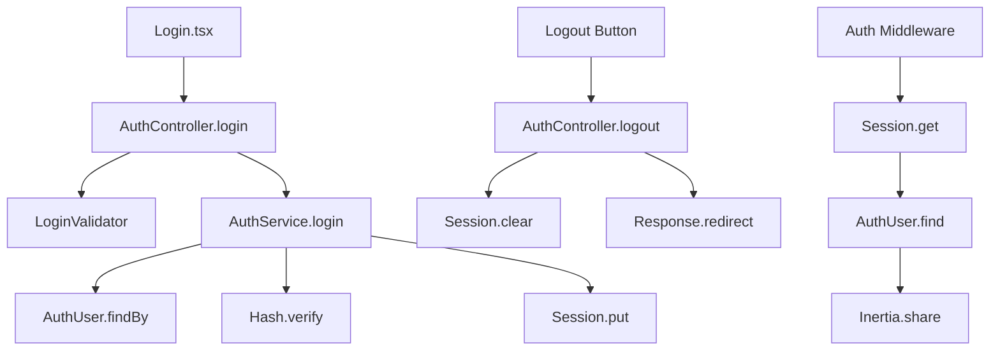

# Design Document

## Overview

This design document outlines the implementation of login and logout functionality for Nooklet, building upon the existing registration system. The solution extends the current authentication architecture to support session-based web authentication while maintaining the existing API token system for future API usage.

The design follows established patterns from the registration implementation, reusing existing components, services, and architectural patterns. The login system will integrate seamlessly with the current `AuthUser` and `Profile` models, providing a consistent user experience that matches the registration flow.

## Steering Document Alignment

### Technical Standards (tech.md)

**Framework Integration**
- Uses AdonisJS v6 authentication system with session guards
- Implements VineJS validation for consistent input handling
- Follows Inertia.js patterns for server-side rendering with client-side navigation
- Maintains TypeScript strict mode with explicit interfaces

**Code Organization**
- Follows domain-driven structure under `app/features/auth/`
- Implements service layer pattern for business logic separation
- Uses dependency injection with proper separation of concerns
- Maintains consistent file naming conventions (snake_case for backend, PascalCase for React)

**Security Standards**
- Implements CSRF protection on all authentication forms
- Uses secure session management with httpOnly cookies
- Follows password security best practices with proper hashing
- Implements rate limiting and proper error handling

### Project Structure (structure.md)

**Domain-Driven Organization**
```
app/features/auth/
├── controllers/auth_controller.ts    # Extended with login/logout methods
├── services/auth_service.ts          # Extended with login/logout logic
├── validators/login_validator.ts     # New VineJS validation schema
└── models/auth_user.ts              # Existing model (no changes needed)
```

**Frontend Structure**
```
inertia/pages/auth/
├── Register.tsx                     # Existing registration page
└── Login.tsx                        # New login page (mirrors Register.tsx)
```

**Configuration Updates**
```
config/auth.ts                       # Extended with session guard
start/routes.ts                      # New login/logout routes
```

## Code Reuse Analysis

### Existing Components to Leverage

**Frontend Components**
- **LabeledTextInput**: Reused for email and password fields with identical props and styling
- **TextInput**: Base input component with daisyUI styling already implemented
- **Inertia useForm Hook**: Existing form handling patterns for validation and submission
- **Flash Message System**: Existing success/error message display via shared props

**Backend Services**
- **AuthUser Model**: Existing model with email/passwordHash fields and Profile relationship
- **Profile Model**: Existing user profile data structure (no changes needed)
- **Hash Service**: Existing password verification using AdonisJS hash service
- **Session Middleware**: Existing session management infrastructure
- **CSRF Protection**: Existing Shield middleware for form security

**Validation Infrastructure**
- **VineJS Integration**: Existing validation patterns from registration
- **Error Handling**: Existing flash message and validation error patterns
- **Request Validation**: Existing controller validation using `request.validateUsing()`

### Integration Points

**Authentication System**
- **Session Management**: Extends existing session configuration to support authentication
- **Middleware Stack**: Integrates with existing auth middleware for route protection
- **Shared Props**: Uses existing Inertia shared props for user data and flash messages

**Database Integration**
- **AuthUser Table**: Uses existing `auth_users` table with email and password_hash columns
- **Profile Relationship**: Leverages existing one-to-one relationship for user data
- **UUID Primary Keys**: Maintains existing UUID-based identification system

**Route Integration**
- **Auth Routes**: Extends existing auth route group with login/logout endpoints
- **Protected Routes**: Uses existing auth middleware for route protection
- **Redirect Logic**: Integrates with existing redirect patterns and landing page

## Architecture

The authentication system extends the existing architecture to support both API token authentication (for future API usage) and session-based authentication (for web interface). This dual approach maintains flexibility while providing secure web-based user sessions.

### Modular Design Principles

**Single File Responsibility**
- `login_validator.ts`: Handles only login form validation schema
- `Login.tsx`: Handles only login form UI and user interactions
- `auth_controller.ts`: Extended with login/logout methods maintaining single responsibility per method
- `auth_service.ts`: Extended with login/logout business logic as separate, focused methods

**Component Isolation**
- Login page component is self-contained and reuses existing form components
- Validation logic is isolated in dedicated validator files
- Business logic is encapsulated in service layer methods
- UI components maintain clear separation from business logic

**Service Layer Separation**
- **Presentation Layer**: Inertia pages handle UI rendering and user interactions
- **Controller Layer**: HTTP request/response handling and validation orchestration
- **Service Layer**: Business logic for authentication, session management, and user lookup
- **Data Layer**: Model interactions and database operations

**Utility Modularity**
- Password verification utilities in dedicated service methods
- Session management utilities in middleware and service layers
- Error handling utilities for consistent error responses
- Validation utilities for reusable validation patterns



## Components and Interfaces

### AuthController Extensions

**Purpose:** Handle HTTP requests for login and logout operations
**New Methods:**
- `showLogin({ inertia })`: Renders login page via Inertia
- `login({ request, response, session, auth })`: Processes login form submission
- `logout({ response, session, auth })`: Handles logout and session cleanup

**Interfaces:**
```typescript
class AuthController {
  async showLogin({ inertia }: HttpContext): Promise<void>
  async login({ request, response, session, auth }: HttpContext): Promise<void>
  async logout({ response, session, auth }: HttpContext): Promise<void>
}
```

**Dependencies:** LoginValidator, AuthService, Inertia, Session
**Reuses:** Existing error handling patterns, flash message system, redirect logic

### AuthService Extensions

**Purpose:** Business logic for authentication operations
**New Methods:**
- `login(email, password)`: Validates credentials and returns user
- `verifyPassword(user, password)`: Verifies password against stored hash

**Interfaces:**
```typescript
interface AuthService {
  login(email: string, password: string): Promise<AuthUser>
  verifyPassword(user: AuthUser, password: string): Promise<boolean>
}
```

**Dependencies:** AuthUser model, Hash service, Database
**Reuses:** Existing transaction patterns, error handling, model relationships

### Login Page Component

**Purpose:** Render login form with validation and error handling
**Props Interface:**
```typescript
interface LoginPageProps {
  flash?: {
    success?: string;
    errors?: Record<string, string>;
  };
}
```

**Dependencies:** LabeledTextInput, useForm hook, Inertia Link
**Reuses:** Existing form components, styling patterns, error display logic

### LoginValidator

**Purpose:** Validate login form input using VineJS
**Schema:**
```typescript
const loginValidator = vine.compile(
  vine.object({
    email: vine.string().trim().email(),
    password: vine.string().minLength(1)
  })
);
```

**Dependencies:** VineJS validation library
**Reuses:** Existing validation patterns and error message formatting

## Data Models

### AuthUser Model (Existing - No Changes)
```typescript
class AuthUser extends BaseModel {
  id: string                    // UUID primary key
  email: string                 // Unique email address
  passwordHash: string          // Hashed password (serializeAs: null)
  isActive: boolean            // Account status flag
  isArchived: boolean          // Soft delete flag
  createdAt: DateTime          // Creation timestamp
  updatedAt: DateTime          // Last update timestamp
  
  // Relationships
  profile: HasOne<typeof Profile>
}
```

### Profile Model (Existing - No Changes)
```typescript
class Profile extends BaseModel {
  id: string                    // UUID primary key
  authUserId: string           // Foreign key to AuthUser
  username: string | null      // Optional username
  displayName: string | null   // Optional display name
  timezone: string | null      // User timezone
  subscriptionTier: string     // Subscription level
  isArchived: boolean          // Soft delete flag
  
  // Relationships
  authUser: BelongsTo<typeof AuthUser>
}
```

### Session Data Structure
```typescript
interface SessionData {
  userId: string               // AuthUser ID
  email: string               // User email for display
  loginAt: DateTime           // Login timestamp
  rememberMe?: boolean        // Extended session flag
}
```

### Login Form Data
```typescript
interface LoginFormData {
  email: string               // User email input
  password: string            // User password input
  rememberMe?: boolean        // Optional remember me checkbox
}
```

## Error Handling

### Error Scenarios

1. **Invalid Credentials**
   - **Handling:** Generic "Invalid email or password" message to prevent user enumeration
   - **User Impact:** Clear error message without revealing whether email exists
   - **Implementation:** Service layer throws generic authentication error

2. **Account Not Found**
   - **Handling:** Same generic message as invalid credentials
   - **User Impact:** Consistent error experience
   - **Implementation:** Service layer normalizes all authentication failures

3. **Account Inactive/Archived**
   - **Handling:** Specific message about account status
   - **User Impact:** Clear guidance on account recovery
   - **Implementation:** Service layer checks account status before password verification

4. **Session Expired**
   - **Handling:** Automatic redirect to login with informative message
   - **User Impact:** Clear explanation and seamless re-authentication flow
   - **Implementation:** Middleware detects invalid session and redirects

5. **Server/Database Errors**
   - **Handling:** Generic "Login temporarily unavailable" message
   - **User Impact:** User-friendly error without technical details
   - **Implementation:** Global exception handler catches and formats errors

6. **CSRF Token Mismatch**
   - **Handling:** Clear message about form security and page refresh
   - **User Impact:** Guidance to refresh page and retry
   - **Implementation:** Shield middleware handles CSRF validation

7. **Rate Limiting**
   - **Handling:** Temporary lockout message with retry guidance
   - **User Impact:** Clear explanation of security measure
   - **Implementation:** Rate limiting middleware with appropriate error responses

## Authentication Configuration

### Session Guard Configuration
```typescript
// config/auth.ts - Extended configuration
const authConfig = defineConfig({
  default: 'web',
  guards: {
    api: tokensGuard({
      provider: tokensUserProvider({
        tokens: 'accessTokens',
        model: () => import('#models/user')
      }),
    }),
    web: sessionGuard({
      provider: sessionUserProvider({
        model: () => import('#features/auth/auth_user')
      }),
    }),
  },
})
```

### Session Configuration
```typescript
// config/session.ts - Existing configuration supports authentication
{
  enabled: true,
  cookieName: 'adonis-session',
  clearWithBrowser: false,  // Supports "remember me" functionality
  age: '2h',               // Default session duration
  cookie: {
    httpOnly: true,        // Security: prevent XSS access
    secure: app.inProduction,
    sameSite: 'lax',
  }
}
```

## Testing Strategy

### Unit Testing

**AuthService Tests**
- `login()` method with valid credentials returns user
- `login()` method with invalid credentials throws error
- `verifyPassword()` method correctly validates passwords
- Error handling for database connection issues

**LoginValidator Tests**
- Valid email and password combinations pass validation
- Invalid email formats are rejected
- Empty fields are rejected with appropriate messages
- Validation error messages are properly formatted

**AuthController Tests**
- `showLogin()` renders correct Inertia page
- `login()` with valid credentials creates session and redirects
- `login()` with invalid credentials shows error and stays on page
- `logout()` clears session and redirects appropriately

### Integration Testing

**Authentication Flow Tests**
- Complete login flow from form submission to dashboard redirect
- Session persistence across multiple requests
- Logout flow with proper session cleanup
- Protected route access with and without authentication

**Error Handling Tests**
- Invalid credentials handling across the full stack
- CSRF protection on login forms
- Rate limiting behavior on repeated failed attempts
- Session expiration and automatic logout

**Database Integration Tests**
- User lookup by email with proper error handling
- Password verification with existing hash algorithms
- Session data storage and retrieval
- Database connection failure scenarios

### End-to-End Testing

**User Authentication Scenarios**
- New user registration followed by immediate login
- Existing user login with valid credentials
- Login attempt with invalid credentials
- "Remember me" functionality across browser sessions
- Logout from authenticated session

**Security Testing**
- CSRF token validation on login forms
- Session hijacking prevention
- Password brute force protection
- Secure cookie handling

**Cross-Browser Testing**
- Login functionality across different browsers
- Session persistence and cookie handling
- Form validation and error display
- Responsive design on mobile devices

**Performance Testing**
- Login response time under normal load
- Session validation performance on protected routes
- Database query optimization for user lookup
- Memory usage for session storage

### Test Data Management

**Test User Creation**
- Factory methods for creating test users with known passwords
- Cleanup procedures for test data
- Isolation between test runs
- Realistic test data for edge cases

**Session Testing**
- Mock session data for unit tests
- Session state management in integration tests
- Cross-request session persistence testing
- Session cleanup verification