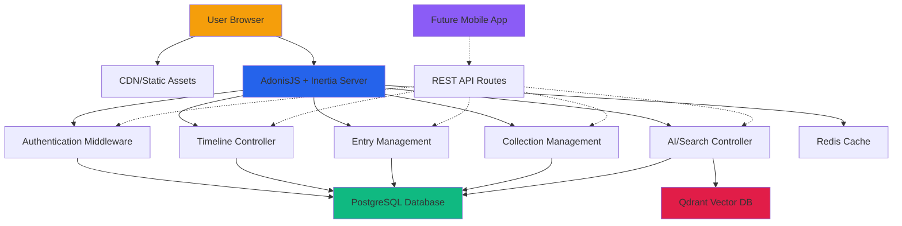

# Nooklet Fullstack Architecture

This document outlines the complete fullstack architecture for **Nooklet**, including backend systems, frontend implementation, and their integration. It serves as the single source of truth for AI-driven development, ensuring consistency across the entire technology stack.

This unified approach combines what would traditionally be separate backend and frontend architecture documents, streamlining the development process for modern fullstack applications where these concerns are increasingly intertwined.

## Starter Template Analysis
**Existing Project Foundation:** AdonisJS v6 + Inertia.js + React
**Current Implementation Status:** Basic authentication (login/logout), user profiles, and home page foundation
**Architecture Constraints:** Must build upon existing AdonisJS backend with Inertia SSR integration
**Database:** PostgreSQL with UUID primary keys and soft-delete patterns already established

## High Level Architecture

### Technical Summary
Nooklet employs a **server-side rendered (SSR) monolithic architecture** using AdonisJS v6 with Inertia.js for seamless React integration, eliminating the need for separate API endpoints while maintaining rich interactivity. The timeline editor leverages **real-time auto-save** through Inertia's partial reloads and **PostgreSQL's JSONB capabilities** for flexible entry storage with strong consistency. **Qdrant vector database** powers semantic search and AI memory features, while **CodeMirror 6** provides the inline markdown rendering foundation. The architecture is designed for **future REST API expansion** to support mobile applications post-MVP, with clear separation between web-specific (Inertia) and API-ready (JSON) response patterns.

### Platform and Infrastructure Choice
**Platform:** Self-hosted or VPS deployment (Railway, DigitalOcean, AWS EC2)
**Key Services:** AdonisJS application server, PostgreSQL database, Qdrant vector DB, Redis for sessions/cache, CDN for static assets
**Deployment Host and Regions:** Single-region deployment initially, with CDN for global asset delivery

**Future Mobile Considerations:** Architecture designed to support REST API endpoints alongside Inertia routes, enabling mobile app development without major refactoring.

### Repository Structure
**Structure:** Monorepo (current structure maintained)
**Monorepo Tool:** npm workspaces (lightweight, already compatible with AdonisJS)
**Package Organization:** Feature-based backend modules, shared TypeScript interfaces, component library

### High Level Architecture Diagram


### Architectural Patterns
- **Server-Side Rendering (SSR) with Inertia:** Eliminates API complexity while maintaining SPA-like experience - _Rationale:_ Perfect for timeline editor's real-time requirements
- **Dual Response Pattern:** Controllers return Inertia responses for web, JSON for future mobile API - _Rationale:_ Enables mobile app development without code duplication
- **Vector-Enhanced Search:** Qdrant integration for semantic entry search and AI memory connections - _Rationale:_ Powers the memory snippet feature and advanced search capabilities
- **Feature-Based Backend Organization:** Logical grouping by business domain (auth, entries, collections, ai) - _Rationale:_ Matches existing codebase structure and scales well
- **Repository Pattern with Lucid ORM:** Abstract data access through AdonisJS models - _Rationale:_ Leverages existing User model patterns and provides type safety
- **Component-Based React UI:** Reusable timeline components with TypeScript - _Rationale:_ Builds on existing MarkdownEditor component foundation
- **Optimistic Updates:** Immediate UI feedback with server reconciliation - _Rationale:_ Critical for <16ms keystroke response requirement
- **Event-Driven Entry Creation:** Time-based and collection-change triggers - _Rationale:_ Implements the 45-minute gap and collection-switch entry logic

### Future Mobile API Strategy
**Post-MVP Mobile Development:**
- **Shared Business Logic:** Controllers use service layer that returns data objects, not responses
- **Response Adapters:** Middleware determines Inertia vs JSON response based on request headers
- **Authentication:** Extend existing auth to support API tokens alongside sessions

## Tech Stack

This is the DEFINITIVE technology selection for the entire Nooklet project, building on your existing foundation while adding the components needed for the timeline editor and AI features:

| Category | Technology | Version | Purpose | Rationale |
|----------|------------|---------|---------|-----------|
| **Frontend Language** | TypeScript | ^5.0 | Type-safe frontend development | Already established, essential for timeline editor complexity |
| **Frontend Framework** | React | ^18.0 | UI component library with Inertia SSR | Existing choice, perfect for timeline virtualization |
| **UI Component Library** | DaisyUI + Custom | ^4.0 | Design system with custom Nooklet theming | Already implemented with navy/slate color system |
| **State Management** | React Context + useReducer | Built-in | Local state for timeline editor | Lightweight, sufficient for Inertia-driven app |
| **Backend Language** | TypeScript | ^5.0 | Type-safe server development | Existing AdonisJS setup |
| **Backend Framework** | AdonisJS | ^6.0 | Full-stack Node.js framework with Inertia | Existing foundation with auth, migrations, features |
| **API Style** | Inertia.js (SSR) + Future REST | ^1.0 | Seamless SSR for web, REST for mobile | Eliminates API complexity for MVP, enables mobile later |
| **Database** | PostgreSQL | ^17.0 | Primary relational database | Existing setup with UUID PKs and proper migrations |
| **Vector Database** | Qdrant | ^1.7 | Semantic search and AI memory features | Powers AI-powered memory snippets |
| **Cache** | Redis | ^7.0 | Session storage and real-time state | Required for performance and session clustering |
| **File Storage** | Local + Future S3 | - | Entry attachments and media | Start simple, scale to cloud storage |
| **Authentication** | AdonisJS Auth + Lucid | Built-in | Session-based auth with future API tokens | Existing implementation, extensible for mobile |
| **Frontend Testing** | Vitest + Testing Library | ^1.0 | Component and integration testing | Modern, fast alternative to Jest |
| **Backend Testing** | Japa | Built-in | AdonisJS native testing framework | Existing setup, excellent for API testing |
| **E2E Testing** | Playwright | ^1.40 | Full user journey testing | Already configured, perfect for timeline editor flows |
| **Build Tool** | Vite | ^5.0 | Fast frontend bundling | Existing Inertia setup |
| **Bundler** | Vite + AdonisJS Assembler | ^5.0 | Frontend and backend build pipeline | Existing configuration |
| **Monitoring** | AdonisJS Logger | Built-in | Structured application logging | Existing setup with proper log levels |
| **CSS Framework** | Tailwind CSS + DaisyUI | ^3.0 | Utility-first styling with components | Existing implementation with custom color system |
| **Markdown Editor** | CodeMirror 6 | ^6.0 | Inline markdown rendering | Existing foundation, perfect for timeline editor |

## Data Models

Based on the front-end specification's timeline editor requirements and your existing User model foundation, here are the core data models:

### User Model (Existing - Extended)
**Purpose:** Authentication and profile management, extended to support timeline preferences

#### TypeScript Interface
```typescript
interface User {
  id: string;
  email: string;
  fullName: string | null;
  createdAt: DateTime;
  updatedAt: DateTime;

  // Relationships
  profile?: Profile;
  entries?: Entry[];
  collections?: Collection[];
}

interface Profile {
  id: string;
  authUserId: string;
  username?: string;
  displayName?: string;
  timezone?: string;
  subscriptionTier?: string;

  // Timeline Editor Preferences
  entryGapMinutes: number; // Default 45 minutes
  defaultCollection?: string;
  autoSaveEnabled: boolean;

  createdAt: DateTime;
  updatedAt: DateTime;
}
```

#### Relationships
- Has one Profile (existing)
- Has many Entries (new)
- Has many Collections (new)

### Entry Model (New - Core Timeline Entity)
**Purpose:** Individual journal entries with time-based creation and collection association

#### TypeScript Interface
```typescript
interface Entry {
  id: string;
  userId: string;
  collectionId: string;

  // Content stored as JSONB for flexibility
  content: {
    markdown: string;
    plainText: string; // For search indexing
    metadata: {
      typingPauses: Array<{
        timestamp: DateTime;
        pauseDurationMs: number;
      }>;
      editHistory?: Array<{
        timestamp: DateTime;
        action: 'create' | 'edit' | 'pause';
      }>;
    };
  };

  // Timeline metadata
  startedAt: DateTime;
  lastActiveAt: DateTime;
  wordCount: number;

  createdAt: DateTime;
  updatedAt: DateTime;

  // Relationships
  user?: User;
  collection?: Collection;
  memoryConnections?: MemoryConnection[];
}
```

#### Relationships
- Belongs to User
- Belongs to Collection
- Has many MemoryConnections (for AI features)

### Collection Model (New - Organization System)
**Purpose:** Filtering and organization system for entries, acts as contextual lenses

#### TypeScript Interface
```typescript
interface Collection {
  id: string;
  userId: string;
  name: string;
  description?: string;
  color: string; // Hex color for UI
  isDefault: boolean;
  sortOrder: number;

  // Metadata
  entryCount: number; // Computed field
  lastEntryAt?: DateTime;

  createdAt: DateTime;
  updatedAt: DateTime;

  // Relationships
  user?: User;
  entries?: Entry[];
}
```

#### Relationships
- Belongs to User
- Has many Entries

### MemoryConnection Model (New - AI Feature)
**Purpose:** AI-generated connections between entries for memory snippet feature

#### TypeScript Interface
```typescript
interface MemoryConnection {
  id: string;
  sourceEntryId: string;
  targetEntryId: string;

  // AI metadata
  connectionType: 'semantic' | 'entity' | 'temporal' | 'emotional';
  relevanceScore: number; // 0-1 AI confidence
  vectorSimilarity: number; // Qdrant similarity score

  // Connection details
  sharedEntities: string[]; // People, places, concepts
  contextSnippet: string; // Brief explanation of connection

  // Lifecycle
  isActive: boolean;
  dismissedAt?: DateTime;

  createdAt: DateTime;
  updatedAt: DateTime;

  // Relationships
  sourceEntry?: Entry;
  targetEntry?: Entry;
}
```

#### Relationships
- Belongs to Entry (source)
- Belongs to Entry (target)

## API Specification

Given the Inertia.js SSR approach with future mobile API considerations, here's the API specification that supports both paradigms:

### API Design Philosophy
**Primary Pattern:** Inertia.js server-side rendering with shared page props
**Secondary Pattern:** REST API endpoints for future mobile applications
**Authentication:** Session-based for web, token-based for mobile API
**Response Format:** Inertia responses for web, JSON for mobile

### Core Endpoints

#### Authentication Endpoints (Existing - Extended)
```typescript
// Web (Inertia) Routes
GET  /login                    // Login page
POST /login                    // Process login
POST /logout                   // Process logout
GET  /register                 // Registration page
POST /register                 // Process registration

// Future Mobile API Routes
POST /api/auth/login           // Mobile login (returns token)
POST /api/auth/logout          // Mobile logout
POST /api/auth/register        // Mobile registration
GET  /api/auth/me              // Get current user
```

#### Timeline & Entry Management
```typescript
// Web (Inertia) Routes - Primary Implementation
GET  /                         // Timeline home page with entries
GET  /timeline                 // Timeline with collection filter
POST /entries                  // Create/update entry (auto-save)
GET  /entries/:id              // View specific entry
PUT  /entries/:id              // Update entry
DELETE /entries/:id            // Archive entry

// Future Mobile API Routes
GET    /api/timeline           // Get timeline entries (paginated)
POST   /api/entries            // Create entry
GET    /api/entries/:id        // Get entry
PUT    /api/entries/:id        // Update entry
DELETE /api/entries/:id        // Archive entry
POST   /api/entries/:id/autosave // Auto-save endpoint
```

#### Collection Management
```typescript
// Web (Inertia) Routes
GET  /collections             // Collection management page
POST /collections             // Create collection
PUT  /collections/:id         // Update collection
DELETE /collections/:id       // Archive collection

// Future Mobile API Routes
GET    /api/collections        // Get user collections
POST   /api/collections        // Create collection
PUT    /api/collections/:id    // Update collection
DELETE /api/collections/:id    // Archive collection
```

#### AI & Search Features (Future - Non-Real-time)
```typescript
// Web (Inertia) Routes
GET  /search                   // Search page with results
POST /search                   // Perform search
GET  /memories/:entryId        // Get memory snippets for entry (on-demand)

// Future Mobile API Routes
GET  /api/search               // Search entries
POST /api/search/semantic      // Semantic search via Qdrant
GET  /api/memories/:entryId    // Get AI memory connections (on-demand)
POST /api/memories/dismiss     // Dismiss memory connection
```

### Request/Response Patterns

#### Inertia Timeline Response (Primary)
```typescript
// GET / or /timeline
interface TimelinePageProps {
  entries: {
    data: Entry[];
    meta: {
      currentPage: number;
      lastPage: number;
      total: number;
    };
  };
  collections: Collection[];
  activeCollection?: Collection;
  user: User;
  preferences: {
    entryGapMinutes: number;
    defaultCollection: string;
    autoSaveEnabled: boolean;
  };
}
```

#### Auto-save Request/Response
```typescript
// POST /entries (auto-save)
interface AutoSaveRequest {
  id?: string;              // Existing entry ID or null for new
  content: {
    markdown: string;
    plainText: string;
  };
  collectionId: string;
  lastActiveAt: string;     // ISO timestamp
  wordCount: number;
}

interface AutoSaveResponse {
  entry: Entry;
  isNewEntry: boolean;
  nextAutoSaveIn: number;   // Milliseconds until next save
}
```

#### Memory Snippets (On-Demand Only)
```typescript
// GET /memories/:entryId
interface MemorySnippetsResponse {
  entryId: string;
  connections: MemoryConnection[];
  generatedAt: string;
  cacheExpiry: string;     // When to regenerate
}
```

## Database Schema

**Approach:** Using AdonisJS Lucid ORM for schema management with incremental migrations as development progresses. Database structure will evolve naturally through Lucid models and migrations rather than upfront schema design.

**Strategy:**
- Leverage existing User and Profile models
- Create Entry and Collection models as needed
- Use Lucid migrations for schema evolution
- Apply soft-delete extensions where appropriate

## Security Considerations

Given Nooklet's personal journaling nature and the timeline editor's real-time features, security is paramount for user trust and data protection:

### Authentication & Authorization

#### Current Implementation (AdonisJS Auth)
**Session-based Authentication:** Leveraging existing AdonisJS auth with secure session management
**Password Security:** Bcrypt hashing with appropriate salt rounds
**Session Management:** Secure session cookies with HttpOnly, Secure, and SameSite flags

#### Authorization Patterns
```typescript
// Entry-level authorization
class EntryPolicy {
  public async view(user: User, entry: Entry): Promise<boolean> {
    return entry.userId === user.id
  }

  public async update(user: User, entry: Entry): Promise<boolean> {
    return entry.userId === user.id
  }
}

// Collection-level authorization
class CollectionPolicy {
  public async view(user: User, collection: Collection): Promise<boolean> {
    return collection.userId === user.id
  }
}
```

#### Future Mobile API Security
**API Token Authentication:** JWT or API tokens for mobile applications
**Token Scope:** Limited scope tokens for specific operations
**Token Rotation:** Automatic token refresh for long-lived sessions

### Data Protection

#### Personal Data Handling
**Data Minimization:** Collect only essential user information (email, preferences)
**Purpose Limitation:** User data used only for timeline functionality and user experience
**Retention Policy:** User-controlled data retention with export/delete capabilities

#### Entry Content Security
**Encryption at Rest:** Database-level encryption for sensitive journal content
**Encryption in Transit:** HTTPS/TLS for all data transmission
**Content Isolation:** Strict user-based data segregation in all queries

#### Privacy Controls
```typescript
// Privacy settings in Profile model
interface PrivacySettings {
  dataRetentionDays?: number;     // Auto-delete old entries
  exportEnabled: boolean;         // Allow data export
  analyticsOptOut: boolean;       // Opt out of usage analytics
  aiProcessingOptOut: boolean;    // Opt out of AI memory features
}
```

### Input Validation & Sanitization

#### Content Validation
**Markdown Sanitization:** Server-side markdown parsing with XSS protection
**Content Length Limits:** Reasonable limits on entry content size
**File Upload Security:** If implemented, strict file type and size validation

#### API Input Validation
```typescript
// Entry validation schema
const entryValidationSchema = schema.create({
  content: schema.object().members({
    markdown: schema.string({ trim: true }, [
      rules.maxLength(100000), // 100KB limit
      rules.escape() // XSS protection
    ]),
    plainText: schema.string({ trim: true }, [
      rules.maxLength(100000)
    ])
  }),
  collectionId: schema.string({}, [
    rules.uuid(),
    rules.exists({ table: 'collections', column: 'id' })
  ])
})
```

#### Rate Limiting
**Auto-save Protection:** Rate limiting on auto-save endpoints to prevent abuse
**API Rate Limits:** Standard rate limiting for all API endpoints
**User-based Limits:** Per-user rate limits for resource-intensive operations

### AI Feature Security (Future)

#### Vector Database Security
**Data Isolation:** User-specific vector collections in Qdrant
**Access Control:** API key-based access to vector database
**Data Anonymization:** Remove personally identifiable information from vectors

#### Memory Connection Privacy
**User Control:** Users can disable AI memory features entirely
**Connection Transparency:** Clear indication of why connections were made
**Data Retention:** Configurable retention for AI-generated connections

## Performance Optimization

Given the front-end specification's demanding performance requirements (<16ms keystroke response, <200ms timeline rendering), here's the comprehensive performance strategy:

### Frontend Performance

#### Timeline Editor Optimization
**Virtual Scrolling:** Render only visible timeline entries to handle 1000+ entries efficiently
**Debounced Auto-save:** 5-minute typing pause detection with optimistic UI updates
**Incremental Markdown Rendering:** Parse and render markdown changes incrementally, not full re-renders
**Component Memoization:** React.memo and useMemo for timeline entry components

#### CodeMirror Editor Optimization
**Lazy Loading:** Load CodeMirror extensions only when needed
**Syntax Highlighting:** Efficient markdown syntax highlighting without blocking
**Change Tracking:** Minimal DOM updates for typing performance
**Memory Management:** Proper cleanup of editor instances

#### Collection Filtering Performance
**Client-side Filtering:** Instant collection switching without server requests
**Cached Results:** Cache filtered timeline results in React state
**Optimistic Updates:** Immediate UI feedback for collection changes

### Backend Performance

#### Database Query Optimization
**Strategic Indexing:** Composite indexes for timeline queries (user_id, started_at DESC)
**Query Batching:** Batch related queries to reduce database round trips
**Connection Pooling:** Efficient database connection management via AdonisJS
**Pagination Strategy:** Cursor-based pagination for infinite scroll performance

#### Auto-save Optimization
**Debounced Saves:** Server-side debouncing to prevent excessive database writes
**Conflict Resolution:** Optimistic locking for concurrent edit handling
**Delta Updates:** Send only changed content, not entire entries
**Background Processing:** Non-blocking save operations

#### Caching Strategy
**Redis Integration:** Cache frequently accessed collections and user preferences
**Query Result Caching:** Cache timeline queries with appropriate TTL
**Session Caching:** Efficient session storage and retrieval
**Static Asset Caching:** CDN integration for CSS, JS, and image assets

### Network Performance

#### Inertia.js Optimization
**Partial Reloads:** Update only changed page sections, not full page reloads
**Prefetching:** Preload likely next pages (collection switches)
**Asset Optimization:** Minimize JavaScript bundle size with code splitting
**Compression:** Gzip/Brotli compression for all responses

#### API Response Optimization
**Response Compression:** Compress JSON responses for mobile API
**Field Selection:** Return only required fields in API responses
**Batch Endpoints:** Combine related operations into single requests
**HTTP/2 Support:** Leverage HTTP/2 multiplexing for better performance

## Deployment Strategy

### Current Deployment Approach
**Staging Environment:** Fly.io (existing)
**Production Planning:** TBD - will evolve based on needs and scale
**Database:** PostgreSQL (existing setup)
**Approach:** Iterative deployment strategy that adapts as requirements become clearer

### AdonisJS Built-in Logging
**Logger:** AdonisJS built-in Logger with structured logging support
**Configuration:** Use existing AdonisJS logging configuration
**Log Levels:** Leverage AdonisJS log levels (debug, info, warn, error, fatal)

```typescript
// Using AdonisJS built-in logger
import Logger from '@ioc:Adonis/Core/Logger'

// In controllers or services
Logger.info('Timeline entry created', {
  userId: user.id,
  entryId: entry.id,
  collectionId: entry.collectionId
})

Logger.error('Auto-save failed', {
  userId: user.id,
  error: error.message,
  entryId: entryId
})
```

### Environment Management
**Development:** Local development with existing setup
**Staging:** Fly.io (current)
**Production:** TBD based on scaling needs
**Configuration:** AdonisJS environment configuration patterns

### Monitoring Approach
**Keep it Simple:** Start with AdonisJS built-in logging and basic health checks
**Evolve as Needed:** Add monitoring tools when scaling requirements become clear
**Focus on Development:** Prioritize development velocity over premature infrastructure optimization

## Testing Strategy

Given your existing Playwright setup and the timeline editor's complexity, here's the comprehensive testing strategy:

### Testing Pyramid

#### Unit Tests (Foundation)
**Framework:** Japa (AdonisJS built-in testing framework)
**Coverage:** Models, services, utilities, and business logic
**Focus:** Individual functions and methods in isolation

#### Integration Tests (Middle Layer)
**Framework:** Japa with database integration
**Coverage:** Controller endpoints, database interactions, auth flows
**Focus:** Feature interactions and data flow

#### E2E Tests (Top Layer)
**Framework:** Playwright (existing setup)
**Coverage:** Complete user journeys, timeline editor interactions
**Focus:** Real user scenarios and cross-browser compatibility

### Timeline Editor Specific Tests

#### Auto-save Testing
**Debounced Save Logic:** Test 5-minute pause detection and save triggering
**Conflict Resolution:** Test concurrent editing scenarios
**Network Resilience:** Test auto-save during network interruptions
**Performance:** Test auto-save performance under load

#### Entry Creation Logic
**Time Gap Detection:** Test 45-minute gap entry creation
**Collection Change Triggers:** Test entry creation on collection switch
**Edge Cases:** Test rapid collection changes, browser refresh scenarios
**Data Integrity:** Test entry relationships and timestamps

#### Collection Management
**Collection CRUD:** Test creation, updating, deletion of collections
**Default Collection:** Test default collection assignment and switching
**Collection Filtering:** Test timeline filtering by collection
**Permission Testing:** Test user isolation for collections

### Performance Testing

#### Frontend Performance Tests
**Keystroke Latency:** Automated tests for <16ms response time
**Timeline Rendering:** Test <200ms rendering with 1000+ entries
**Memory Usage:** Test for memory leaks during long editing sessions
**Virtual Scrolling:** Test smooth scrolling performance

#### Backend Performance Tests
**Database Query Performance:** Test timeline query execution times
**Auto-save Performance:** Test save operation latency
**Concurrent User Testing:** Test system under multiple simultaneous users
**Memory Profiling:** Test for memory leaks in long-running processes

### Test Data Management

#### Test Database Strategy
**Isolated Tests:** Each test runs with clean database state
**Factory Pattern:** Use factories for creating test data
**Realistic Data:** Test with realistic entry content and user patterns
**Edge Case Data:** Test with empty collections, large entries, special characters

### Continuous Testing

#### Test Automation
**Pre-commit Hooks:** Run unit tests before commits
**CI Pipeline:** Run full test suite on pull requests
**Nightly Tests:** Run performance and E2E tests nightly
**Cross-browser Testing:** Test timeline editor across browsers

#### Test Monitoring
**Test Performance:** Monitor test execution times
**Flaky Test Detection:** Identify and fix unreliable tests
**Coverage Tracking:** Maintain test coverage metrics
**Test Reporting:** Clear test results and failure analysis

## Next Steps

After completing this comprehensive fullstack architecture for Nooklet's timeline editor, here are the recommended next steps:

### Immediate Actions

1. **Technical validation** - Confirm the AdonisJS + Inertia approach can support the real-time timeline editor requirements
2. **Stakeholder alignment** - Share with team members for feedback on the technical approach
3. **Development environment setup** - Ensure local development environment supports the architecture decisions
4. **Proof of concept** - Build a minimal timeline editor prototype to validate core assumptions

### Architecture Handoff Checklist

- [x] **High-level architecture defined** - SSR monolithic approach with Inertia.js and future mobile API support
- [x] **Technology stack finalized** - AdonisJS, React, PostgreSQL, Redis, Qdrant for AI features
- [x] **Data models specified** - User, Entry, Collection, MemoryConnection with clear relationships
- [x] **API patterns established** - Inertia SSR primary, REST API for future mobile development
- [x] **Performance strategy outlined** - Virtual scrolling, debounced auto-save, strategic indexing
- [x] **Security considerations addressed** - Authentication, authorization, data protection, privacy controls
- [x] **Testing approach defined** - Japa for backend, Playwright for E2E, comprehensive timeline editor testing

### Preparation for Story Creation Phase

**Ready for Product Owner/Scrum Master handoff:**
- This architecture document provides the technical foundation for creating development stories
- The PO should focus on breaking down the timeline editor features into implementable stories
- Key story areas: entry management, collection filtering, auto-save system, AI memory features

**Critical technical requirements for story creation:**
- **Timeline editor implementation**: Real-time inline markdown rendering with <16ms keystroke response
- **Auto-save system**: Debounced saves with 5-minute pause detection and collection-change triggers
- **Collection management**: Filter-based organization system with instant switching
- **Performance optimization**: Virtual scrolling and efficient database queries for large timelines

### Success Criteria for Next Phase

The story creation phase will be successful when:
- **Feature stories defined** that implement the timeline editor incrementally
- **Technical debt managed** through proper story estimation and technical tasks
- **Performance requirements maintained** in story acceptance criteria
- **User experience preserved** through careful feature breakdown and testing

---

## 🏗️ Fullstack Architecture Complete!

This architecture document provides a comprehensive technical foundation for Nooklet's innovative timeline editor:

- **Server-side rendered approach** using AdonisJS + Inertia for optimal performance
- **Real-time timeline editor** with inline markdown rendering and intelligent auto-save
- **Collection-based organization** that acts as contextual filters rather than rigid folders
- **Future AI integration** ready for semantic search and memory snippet features
- **Performance optimization** strategy to meet demanding UX requirements
- **Scalable foundation** that grows from MVP to full-featured application

**Next step in the Greenfield workflow:** Hand off to the **Product Owner** to create development stories that implement this architecture incrementally.

Ready to proceed with story creation and development!

