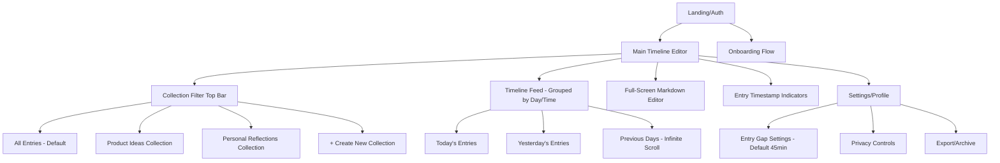
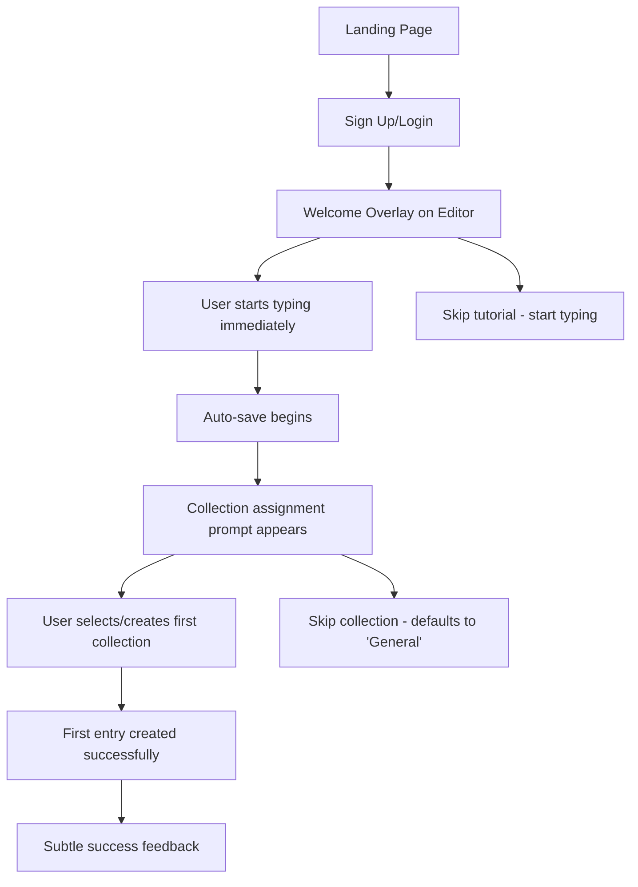
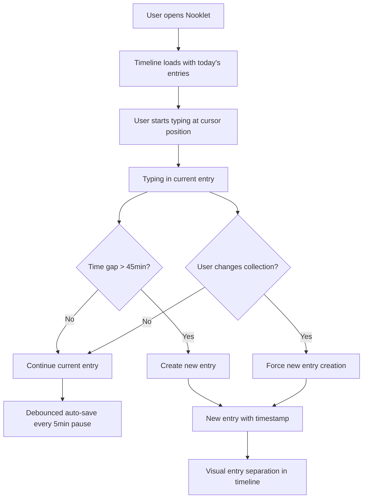
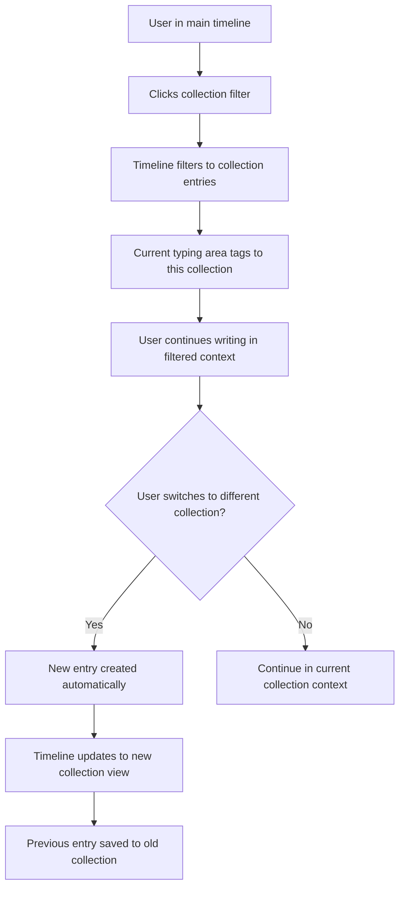
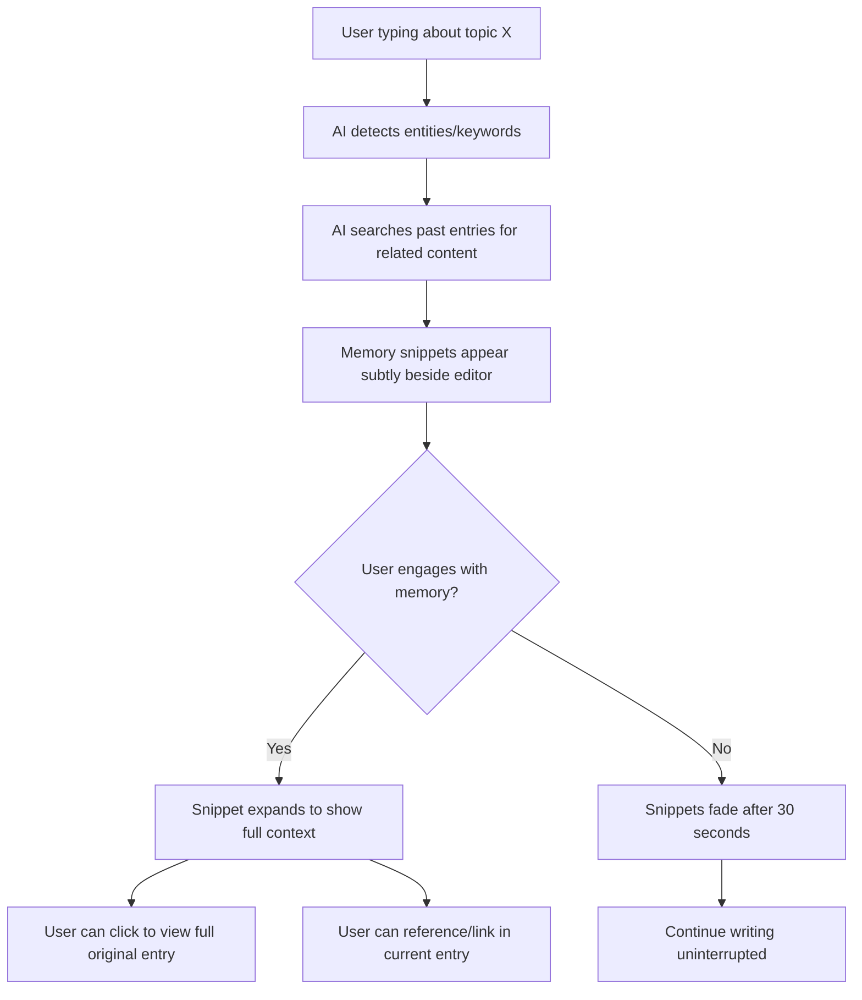

# Nooklet UI/UX Specification

This document defines the user experience goals, information architecture, user flows, and visual design specifications for **Nooklet**'s user interface. It serves as the foundation for visual design and frontend development, ensuring a cohesive and user-centered experience.

## Overall UX Goals & Principles

### Target User Personas

**Primary Personas:**
- **The Reflective Creator:** Knowledge workers and content creators who need to capture thoughts quickly but want them organized and retrievable. Values speed of capture but also depth of reflection.
- **The Overwhelmed Curator:** Users struggling with "bookmark graveyard" - they save content but never revisit it. Needs motivation and intelligent surfacing to actually consume saved material.
- **The Pattern Seeker:** Users who want to understand their own thoughts and behaviors over time. Values AI insights, mood tracking, and discovering connections between past and present experiences.

### Usability Goals

**Core Usability Targets:**
- **Time to First Nooklet (TTFN)**: <3 minutes from signup to first published nooklet (directly from PRD)
- **Capture Friction**: New nooklet creation in <30 seconds for returning users
- **Discovery Delight**: Users find relevant past content within 2 clicks of current context
- **Privacy Confidence**: 100% clarity on privacy settings before publishing any content
- **AI Trust**: Users understand and can control all AI-generated insights and suggestions

### Design Principles

**Core Design Principles:**
1. **Capture First, Organize Later** - Never let organization complexity block the creative flow
2. **Intelligent Surfacing Over Manual Search** - AI should proactively surface relevant content rather than requiring users to remember and search
3. **Privacy by Design** - Every interaction should make privacy controls obvious and accessible
4. **Progressive Disclosure of Power** - Start simple, reveal advanced features as users demonstrate need
5. **Emotional Context Awareness** - Design should acknowledge and respond to user's emotional state and patterns

## Information Architecture (IA)

### Site Map / Screen Inventory

### Navigation Structure

**Primary Navigation:** 
- **Main Timeline Editor** - Single-page app with full markdown editor as the primary interface
- **Collection Filters** - Top navigation bar for filtering timeline by collection
- **Settings** - Minimal settings access (entry gap timing, privacy, export)

**Secondary Navigation:**
- **Day/Time Grouping** - Visual groupings in timeline, no separate navigation needed
- **Collection Assignment** - Contextual tagging of current entry to collections
- **Timestamp Indicators** - Visual cues showing time gaps within entries

**Breadcrumb Strategy:**
- **No breadcrumbs needed** - Single-page timeline interface with collection filtering
- **Context preservation** - Current collection filter and scroll position maintained

## User Flows

### Flow 1: First-Time User Onboarding & First Entry

**User Goal:** Get from signup to first nooklet entry in <3 minutes (TTFN goal)

**Entry Points:** Landing page, referral links, direct signup

**Success Criteria:** User has created their first entry and understands the basic concept

#### Flow Diagram:

#### Edge Cases & Error Handling:
- User closes browser during onboarding → Auto-save preserves partial content
- User doesn't select collection → Defaults to "General" collection
- Network issues during signup → Offline mode with sync when reconnected
- User types nothing for 10+ minutes → Gentle prompt to continue or save

### Flow 2: Daily Writing & Entry Management

**User Goal:** Seamlessly capture thoughts throughout the day with automatic entry organization

**Entry Points:** Returning to the main timeline editor

**Success Criteria:** Multiple entries created naturally based on time gaps and collection changes

#### Flow Diagram:

#### Edge Cases & Error Handling:
- User accidentally changes collection → Undo option to merge back
- Multiple rapid collection changes → Prevent spam entry creation
- Long writing session (>2 hours) → Periodic timestamp markers within entry
- Browser crash during writing → Auto-recovery of unsaved content

### Flow 3: Collection-Based Filtering & Organization

**User Goal:** Focus on specific topics/projects by filtering timeline to relevant entries

**Entry Points:** Collection filter top bar, search, or direct collection links

**Success Criteria:** User can quickly switch between different content contexts

#### Flow Diagram:

#### Edge Cases & Error Handling:
- Empty collection selected → Show empty state with writing prompt
- User creates new collection while typing → Current entry gets tagged to new collection
- Rapid collection switching → Debounce to prevent excessive entry creation

### Flow 4: Memory Snippet Discovery (Future Feature)

**User Goal:** Discover relevant past thoughts while writing about similar topics

**Entry Points:** AI detects entities/topics in current writing

**Success Criteria:** User finds valuable connections to past entries without disrupting writing flow

#### Flow Diagram:

#### Edge Cases & Error Handling:
- No related memories found → No snippets shown (don't force it)
- Too many memories → Show only top 2-3 most relevant
- User finds memories distracting → Settings to reduce/disable
- Memory snippet loading slow → Show placeholder, load asynchronously

## Wireframes & Mockups

### Design Files
**Primary Design Files:** To be determined - recommend Figma for collaborative design and prototyping of the timeline editor interface

### Key Screen Layouts

#### Main Timeline Editor Interface (Current Implementation)

**Purpose:** Single-page application serving as both content creation and consumption interface

**Key Elements:**
- **Top navigation bar** - Collection and tag filters positioned at the top of the page
- **Full-width markdown editor** - Primary focus area below the top navigation
- **Timeline entries display** - Chronological entries grouped by day/time, integrated with editor
- **Subtle timestamp indicators** - Visual markers showing entry boundaries and time gaps

**Interaction Notes:**
- Collection/tag filters at top immediately filter the timeline view
- Editor cursor position determines which entry user is currently editing
- Current typing automatically tags to selected collection filter
- Smooth scrolling between entries with clear visual separation

**Design File Reference:** [Partially implemented - current layout foundation]

#### Entry Boundary & Timestamp Visualization

**Purpose:** Clearly delineate separate entries while maintaining writing flow

**Key Elements:**
- **Subtle horizontal dividers** - Between entries with timestamp labels
- **Time gap indicators** - Visual cues showing significant time breaks within entries
- **Collection tags** - Small, colored indicators showing which collection each entry belongs to
- **Entry metadata** - Word count, creation time, last modified (on hover/focus)

**Interaction Notes:**
- Hovering over entry boundaries reveals metadata
- Clicking timestamp allows manual entry splitting/merging
- Collection tags are clickable for quick filtering

**Design File Reference:** [Entry visualization patterns - to be created]

#### Collection Management Interface

**Purpose:** Lightweight collection creation and management without disrupting writing flow

**Key Elements:**
- **Collection filter bar** - Top navigation showing all collections with entry counts and color coding
- **Quick collection creation** - Inline input field for new collection creation
- **Collection settings** - Minimal options (rename, color, archive) accessible via right-click/long-press
- **Filter states** - Clear visual indication of active collection filter vs. "All entries" view

**Interaction Notes:**
- Collection creation happens inline without modal dialogs
- Visual feedback when switching collections shows timeline filtering
- Drag-and-drop to move entries between collections (future enhancement)

**Design File Reference:** [Collection management patterns - to be created]

#### Memory Snippets Interface (Future Feature)

**Purpose:** Contextually surface relevant past entries without disrupting writing flow

**Key Elements:**
- **Floating snippet cards** - Small, dismissible cards appearing near relevant text
- **Snippet preview** - First few lines of related entry with timestamp and collection context
- **Relevance indicators** - Visual cues showing why this memory is relevant (shared entities, similar topics)
- **Expansion options** - Click to view full entry, link to current entry, or dismiss

**Interaction Notes:**
- Snippets appear/disappear based on typing context with smooth animations
- Non-intrusive positioning that doesn't block writing
- Smart timing - appear after user pauses, not during active typing

**Design File Reference:** [Memory snippet interaction patterns - to be created]

## Component Library / Design System

### Design System Approach

**Design System Approach:** Build a lightweight, custom component library focused on the unique editor-first interface requirements. Given the innovative timeline editor concept, existing design systems (Material, Ant Design, etc.) may not have the specialized components needed for seamless writing and timeline visualization.

### Core Components

#### Timeline Entry Component

**Purpose:** Display individual journal entries with clear temporal context and collection association

**Variants:**
- **Active Entry** - Currently being edited, with cursor and typing indicators
- **Recent Entry** - Recently created entries (today/yesterday) with full content visible
- **Historical Entry** - Older entries with collapsed/preview state
- **Empty State** - Placeholder for new entries in filtered collections

**States:**
- **Default** - Standard display with timestamp and collection tag
- **Hover** - Reveals edit options and metadata (word count, time spent)
- **Focus/Edit** - Active editing state with expanded controls
- **Loading** - Auto-save in progress indicator

**Usage Guidelines:**
- Maintain consistent spacing between entries for visual rhythm
- Use subtle animations for state transitions to avoid jarring changes
- Ensure keyboard navigation works seamlessly between entries

#### Collection Filter Component

**Purpose:** Top navigation element for switching between content collections

**Variants:**
- **Dropdown Style** - Compact list for many collections
- **Tab Style** - Horizontal tabs for fewer collections (≤6)
- **Hybrid Style** - Tabs for favorites + dropdown for all collections

**States:**
- **Default** - Available collection with entry count
- **Active** - Currently selected collection with distinct styling
- **Empty** - Collection with no entries, with creation prompt
- **Loading** - Collection switching in progress

**Usage Guidelines:**
- Active collection should be immediately obvious
- Entry counts help users understand content distribution
- Quick keyboard shortcuts (Cmd+1, Cmd+2, etc.) for frequent collections

#### Timestamp Indicator Component

**Purpose:** Show temporal context and entry boundaries within the timeline

**Variants:**
- **Entry Header** - Main timestamp for entry start (e.g., "Today, 2:30 PM")
- **Time Gap Marker** - Indicates significant pause within entry (e.g., "...15 min later...")
- **Day Separator** - Visual break between different days
- **Relative Time** - Human-friendly time descriptions ("2 hours ago", "Yesterday")

**States:**
- **Default** - Standard timestamp display
- **Hover** - Shows exact timestamp and duration information
- **Interactive** - Clickable for manual entry splitting/merging (future feature)

**Usage Guidelines:**
- Use consistent time format throughout application
- Relative times for recent content, absolute times for older content
- Visual hierarchy: day separators > entry headers > time gaps

#### Markdown Editor Component

**Purpose:** Core writing interface with real-time inline markdown rendering

**Variants:**
- **Active Editor** - Currently focused with cursor visible and real-time rendering
- **Inactive Editor** - Blurred state when not in focus, rendered markdown visible
- **Historical Entry View** - Read-only rendered markdown for past entries

**States:**
- **Active** - Currently focused with cursor visible and live rendering
- **Inactive** - Blurred state when not in focus
- **Auto-saving** - Visual indicator of save progress
- **Offline** - Distinct styling when network unavailable

**Usage Guidelines:**
- Real-time rendering provides immediate visual feedback
- Cursor and selection states work seamlessly with rendered content
- Keyboard shortcuts follow standard markdown conventions
- No mode switching required - writing and reading happen simultaneously

#### Memory Snippet Component (Future Feature)

**Purpose:** Display AI-generated contextual connections to past entries

**Variants:**
- **Floating Card** - Appears near relevant text with smooth animation
- **Sidebar Panel** - Fixed area for multiple memory suggestions
- **Inline Suggestion** - Embedded within text flow as subtle highlights

**States:**
- **Appearing** - Smooth fade-in animation when AI detects relevance
- **Default** - Visible but non-intrusive display
- **Expanded** - Shows full context and interaction options
- **Dismissing** - Fade-out animation when no longer relevant

**Usage Guidelines:**
- Never interrupt active typing flow
- Provide clear visual connection between current text and suggested memory
- Easy dismissal options to maintain user control

## Branding & Style Guide

### Visual Identity

**Brand Guidelines:** Nooklet uses a sophisticated dark theme with navy/slate foundation and warm accent colors, emphasizing focus and readability for extended writing sessions.

### Color Palette (Current Implementation)

| Color Type | CSS Variable | Hex/Value | Usage |
|------------|--------------|-----------|--------|
| **Primary Brand** | `--brand-accent` | `var(--color-nookb-600)` | Active collection filters, primary CTAs, focus states |
| **Primary Hover** | `--brand-accent-hover` | `var(--color-blue-300)` | Interactive hover states |
| **Background** | `--brand-bg` | `var(--color-navy-900)` (#1a1d29) | Main application background |
| **Text** | `--brand-text` | `var(--color-slate-100)` (#f1f5f9) | Primary text content |
| **Borders** | `--brand-border` | `var(--color-gray-800)` (#2a2d3a) | Subtle dividers and borders |
| **Cards** | `--brand-card` | `var(--color-navy-950)` (#111422) | Entry containers and elevated surfaces |
| **Success** | `--color-success` | #10b981 | Auto-save indicators, positive feedback |
| **Warning** | `--color-warning` | #f59e0b | Unsaved changes, important notices |
| **Error** | `--color-error` | #ef4444 | Error states, failed operations |
| **Info** | `--color-info` | #60a5fa | Informational messages, neutral feedback |

### Nooklet Color System

**Navy/Slate Foundation (--color-nookb-*):**
- **50-200**: Lightest tones for subtle highlights and hover states
- **300-500**: Mid-range for secondary elements and muted text
- **600-800**: Primary brand colors and active states
- **900-1000**: Darkest tones for backgrounds and depth

**Accent System (--color-accent-*):**
- Warm accent palette (50.3 hue) providing contrast to the cool navy foundation
- Used sparingly for special highlights and future AI memory features

### Typography

#### Font Families
- **Primary:** System font stack (Inter-like) for UI elements and metadata
- **Editor:** Monospace (JetBrains Mono/Fira Code) for markdown editing
- **Content:** Serif (Georgia/Charter) for rendered markdown content

#### Type Scale
Following your existing DaisyUI integration with custom brand tokens.

### Spacing & Layout

**Border Radius System:**
- `--radius-selector`: 0.375rem (6px) - Small interactive elements
- `--radius-field`: 0.5rem (8px) - Input fields and form elements
- `--radius-box`: 0.75rem (12px) - Cards and larger containers

**Border System:**
- `--border`: 1px standard border width
- `--input-border`: Uses `--color-base-300` for consistent field styling

### Iconography

**Icon Library:** Heroicons or Lucide React for consistent, minimal icon style

**Usage Guidelines:**
- Use outline style for inactive states, filled style for active states
- Maintain 16px or 20px sizes for UI consistency
- Icons should support the writing flow, not distract from it

### Spacing & Layout

**Grid System:** 8px base unit system for consistent spacing throughout interface

**Spacing Scale:**
- xs: 4px (tight spacing within components)
- sm: 8px (component internal spacing)
- md: 16px (standard component spacing)
- lg: 24px (section spacing)
- xl: 32px (major layout spacing)
- 2xl: 48px (page-level spacing)

## Accessibility Requirements

### Compliance Target

**Standard:** WCAG 2.1 AA compliance with progressive enhancement toward AAA where feasible, particularly for color contrast and keyboard navigation.

### Key Requirements

**Visual:**
- **Color contrast ratios:** Minimum 4.5:1 for normal text, 3:1 for large text against your navy background
- **Focus indicators:** Clear, high-contrast focus rings for all interactive elements (collection filters, timestamps, entry boundaries)
- **Text sizing:** Support browser zoom up to 200% without horizontal scrolling or content loss
- **Color independence:** All information conveyed by color (collection tags, entry states) must also be available through text or icons

**Interaction:**
- **Keyboard navigation:** Full keyboard access to all features - Tab through collections, arrow keys for entry navigation, standard markdown shortcuts
- **Screen reader support:** Proper semantic markup for timeline structure, entry boundaries, and collection relationships
- **Touch targets:** Minimum 44px touch targets for mobile collection filters and interactive elements
- **Focus management:** Logical focus order through timeline entries and collection filters

**Content:**
- **Alternative text:** Descriptive text for any icons or visual indicators (collection status, auto-save states, time gaps)
- **Heading structure:** Proper heading hierarchy for entry organization and timeline navigation
- **Form labels:** Clear labels and descriptions for collection creation and settings

### Testing Strategy

**Automated Testing:**
- Integration with axe-core for continuous accessibility monitoring
- Color contrast validation for all brand color combinations
- Keyboard navigation testing in CI/CD pipeline

**Manual Testing:**
- Screen reader testing with NVDA, JAWS, and VoiceOver
- Keyboard-only navigation testing for complete user flows
- Mobile accessibility testing for touch interaction patterns

**User Testing:**
- Testing with users who rely on assistive technologies
- Validation of timeline navigation patterns with screen reader users
- Feedback on collection organization accessibility

## Responsiveness Strategy

### Breakpoints

| Breakpoint | Min Width | Max Width | Target Devices |
|------------|-----------|-----------|----------------|
| **Mobile** | 320px | 767px | Phones, small tablets in portrait |
| **Tablet** | 768px | 1023px | Tablets, small laptops |
| **Desktop** | 1024px | 1439px | Standard laptops, desktop monitors |
| **Wide** | 1440px | - | Large monitors, ultrawide displays |

### Adaptation Patterns

**Layout Changes:**
- **Mobile**: Single-column layout with collection filters moved to top dropdown/tabs, full-width editor
- **Tablet**: Collection filters remain at top, editor gets comfortable margins, timeline entries stack naturally
- **Desktop**: Optimal layout with top navigation, spacious editor area, and room for future memory snippets
- **Wide**: Additional whitespace, potential for side panels (future AI features), but editor remains centered

**Navigation Changes:**
- **Mobile**: Collection filters collapse to hamburger menu or horizontal scrolling tabs
- **Tablet**: Collection filters as horizontal tabs with overflow scrolling if needed
- **Desktop**: Full collection filter display in top navigation bar
- **Wide**: Collection filters with additional space for more collections or enhanced filtering

**Content Priority:**
- **Mobile**: Editor takes full priority, timeline entries below with minimal metadata visible
- **Tablet**: Balanced view with editor prominent but timeline entries showing more context
- **Desktop**: Full timeline context with entry metadata, timestamps, and collection indicators
- **Wide**: Enhanced timeline view with potential for memory snippets and advanced features

**Interaction Changes:**
- **Mobile**: Touch-optimized targets (44px minimum), swipe gestures for collection switching
- **Tablet**: Hybrid touch/keyboard interaction, larger touch targets for precision
- **Desktop**: Keyboard-first interaction with mouse support, hover states for additional context
- **Wide**: Full keyboard shortcuts, enhanced hover states, potential for advanced power-user features

## Animation & Micro-interactions

### Motion Principles

**Motion Principles:**
- **Purposeful movement**: Every animation serves a functional purpose (feedback, guidance, or state communication)
- **Respect writing flow**: Animations never interrupt active typing or thinking
- **Subtle enhancement**: Motion enhances understanding rather than drawing attention to itself
- **Performance conscious**: Smooth 60fps animations that don't impact editor responsiveness
- **Accessibility aware**: Respects `prefers-reduced-motion` for users who need minimal animation

### Key Animations

**Entry Creation & Boundaries:**
- **New entry formation**: Subtle fade-in (300ms, ease-out) when 45-minute gap creates new entry
- **Entry separation**: Gentle slide-down (200ms, ease-in-out) when new entry appears above current writing
- **Time gap indicators**: Soft pulse (1s, ease-in-out) when 5-minute pause creates timestamp marker

**Collection & Filter Transitions:**
- **Collection switching**: Smooth timeline filter (400ms, ease-in-out) with content fade-out/fade-in
- **Filter state changes**: Quick highlight (150ms, ease-out) on active collection tab
- **Collection creation**: Inline expansion (250ms, ease-out) for new collection input field

**Auto-save & Status Feedback:**
- **Save progress**: Subtle spinner or dot animation (continuous, 2s rotation) during auto-save
- **Save confirmation**: Brief checkmark flash (500ms, ease-out) when save completes
- **Connection status**: Gentle color transition (300ms, ease-in-out) for online/offline states

**Timeline Navigation:**
- **Scroll position**: Smooth scroll (600ms, ease-in-out) when jumping to specific dates or entries
- **Entry focus**: Subtle highlight fade-in (200ms, ease-out) when navigating between entries
- **Hover states**: Quick opacity/color transitions (100ms, ease-out) for interactive elements

**Future Memory Snippets:**
- **Snippet appearance**: Gentle slide-in from right (400ms, ease-out) when AI detects relevance
- **Snippet dismissal**: Quick fade-out (200ms, ease-in) when user dismisses or context changes
- **Relevance indication**: Soft glow or border animation (300ms, ease-in-out) connecting snippet to relevant text

**Loading & State Changes:**
- **Content loading**: Skeleton animation (1.5s, ease-in-out) for timeline entries loading
- **Error states**: Gentle shake (300ms, ease-out) for failed operations
- **Success feedback**: Brief scale animation (200ms, ease-out) for successful actions

## Performance Considerations

### Performance Goals

- **Keystroke Response:** <16ms latency for typing input (60fps target)
- **Auto-save Operations:** <100ms for debounced save operations
- **Timeline Rendering:** <200ms for filtering/switching collections with 1000+ entries
- **Memory Usage:** <50MB baseline, <100MB with large timeline histories
- **Initial Load:** <2s for application ready state, <1s for returning users

### Design Strategies

**Real-time Editor Optimization:**
- **Virtual scrolling** for timeline with 1000+ entries to maintain smooth scrolling
- **Debounced auto-save** (5-minute typing pause) to prevent excessive server requests
- **Local-first architecture** with optimistic updates for immediate feedback
- **Incremental rendering** for markdown parsing to avoid blocking the main thread
- **Memory-efficient** entry storage with lazy loading for historical content

**Timeline Performance:**
- **Pagination strategy** for historical entries (load 50 entries initially, infinite scroll for more)
- **Collection filtering** happens client-side for instant switching between collections
- **Entry caching** to avoid re-rendering unchanged content during scrolling
- **Timestamp indexing** for fast date-based navigation and search

**Network Optimization:**
- **Offline-first** design with service worker for uninterrupted writing during connectivity issues
- **Delta sync** for auto-save operations (only send changed content, not entire entries)
- **Background sync** for queued operations when connection is restored
- **CDN optimization** for static assets and font loading

**Memory Management:**
- **Entry virtualization** to render only visible timeline entries
- **Component cleanup** for unmounted entries to prevent memory leaks
- **Image lazy loading** for any embedded media in entries
- **Garbage collection** optimization for long writing sessions

**Future AI Feature Performance:**
- **Async memory snippet generation** that doesn't block writing interface
- **Cached similarity searches** for frequently accessed content connections
- **Progressive enhancement** where AI features load after core editor is ready
- **Throttled AI requests** to prevent overwhelming the system during active typing

## Next Steps

After completing the UI/UX specification for Nooklet's innovative timeline editor, here are the recommended next steps:

### Immediate Actions

1. **Save and review this front-end specification** as `docs/front-end-spec.md` in your project
2. **Stakeholder review** - Share with team members for feedback on the editor-first approach and timeline interface concepts
3. **Technical feasibility validation** - Confirm the inline markdown rendering and real-time auto-save approach with development team
4. **Accessibility audit** - Review current implementation against WCAG 2.1 AA requirements outlined in this spec
5. **Performance baseline** - Establish current performance metrics to track against the goals defined here

### Design Handoff Checklist

- [x] **All user flows documented** - Onboarding, daily writing, collection filtering, and future memory snippets
- [x] **Component inventory complete** - Timeline entries, collection filters, timestamp indicators, markdown editor, memory snippets
- [x] **Accessibility requirements defined** - WCAG 2.1 AA compliance with specific timeline interface considerations
- [x] **Responsive strategy clear** - Mobile-first approach with writing continuity across all devices
- [x] **Brand guidelines incorporated** - Existing navy/slate color system and DaisyUI integration documented
- [x] **Performance goals established** - Specific targets for keystroke response, auto-save, and timeline rendering

### Preparation for Architecture Phase

**Ready for Architect handoff:**
- This UI/UX specification provides the foundation for the **fullstack architecture** document
- The architect should focus on implementing the editor-first approach with real-time features
- Key technical challenges to address: inline markdown rendering, debounced auto-save, timeline virtualization, and future AI memory integration

**Critical technical requirements for architect:**
- **Real-time editor**: Inline markdown rendering with <16ms keystroke response
- **Auto-save system**: Debounced saves with 5-minute pause detection and collection-change triggers
- **Timeline performance**: Virtual scrolling and client-side filtering for 1000+ entries
- **Offline-first**: Service worker implementation for uninterrupted writing
- **Future AI readiness**: Architecture that supports contextual memory snippet integration

### Open Questions for Architect

1. **Technology stack validation**: Does the current AdonisJS + Inertia + React stack support the real-time inline rendering requirements?
2. **Database design**: How should entry timestamps and collection relationships be optimized for timeline queries?
3. **Auto-save implementation**: What's the optimal approach for debounced saves with conflict resolution?
4. **AI integration architecture**: How should the future memory snippet system be designed for performance and scalability?

### Success Criteria for Next Phase

The architecture phase will be successful when:
- **Technical feasibility confirmed** for all UX requirements outlined in this specification
- **Performance targets validated** through prototyping or technical analysis
- **Implementation roadmap created** that maintains the writing-first user experience
- **AI integration strategy defined** for future memory snippet features

---

## 🎉 Front-End Specification Complete!

This specification captures Nooklet's innovative editor-first approach with:
- **Timeline-based organization** that matches human memory patterns
- **Seamless writing experience** with minimal friction and intelligent auto-save
- **Collection-based filtering** that acts as contextual lenses rather than rigid folders
- **Future AI integration** ready for contextual memory snippets
- **Accessibility and performance** considerations for all users

**Next step in the Greenfield workflow:** Hand off to the **Architect** to create the fullstack architecture document that implements these UX requirements.

Ready to proceed with `*agent architect`!
